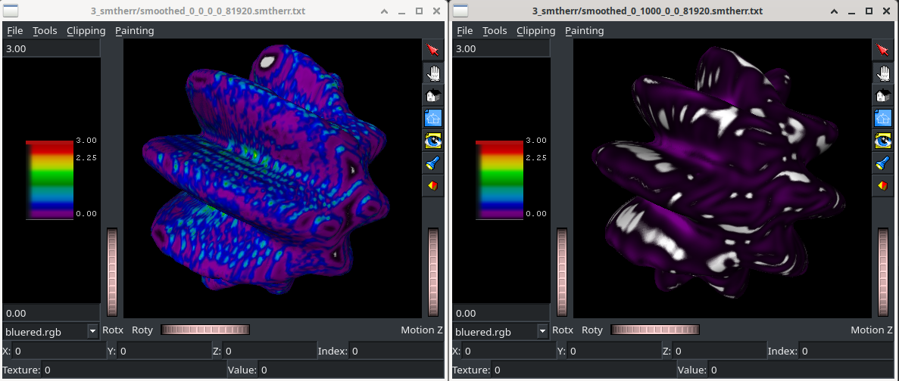

# Modeled Smoothness Error Experiment

This is a [Datalad](https://www.datalad.org) repository
containing an experiment on how to measure "smoothness"
and "voxelation" error of polygonal mesh surfaces.

## Experiment

See `git log` for exact history.

1. (data provenance missing) The model mask was created using
   [pl-parmodel-surface](https://github.com/FNNDSC/pl-parmodel-surface)
   with the equation `r(theta,phi)=20+5*sin(10*theta)*sin(phi)`
2. b863770a83ba2c9d7dc9550055d29ded095ffdfd a polygonal mesh surface
   exhibiting severe voxelation error was produced using
   [pl-fetal-cp-surface-extract version 1.2.1](https://github.com/FNNDSC/pl-fetal-surface-extract/tree/v1.2.1)
3. a5319f4dcfbcc556955478a745bdd41b1bb18091 `adapt_object_mesh` (Taubin smoothing)
   was run many times with varying number of smoothing iterations
4. 1cdd6381a3f0644e9e8ff1d0c5f069788394d50d smoothness error was
   calculated using
   [pl-smoothness-error](https://github.com/FNNDSC/pl-smoothness-error)
5. Mean _smtherr_ was calculated and written to [5_notebook/taubin_vs_smtherr.csv](5_notebook/taubin_vs_smtherr.csv)
   in [5_notebook/taubin_smoothing_vs_voxelization_error.ipynb](5_notebook/taubin_smoothing_vs_voxelization_error.ipynb)
6. We performed least-squares regression fitting a reciprocal function between Taubin smoothing iterations
   and mean _smtherr_ in [5_notebook/taubin_vs_mean_smtherr.ipynb](5_notebook/taubin_vs_mean_smtherr.ipynb)